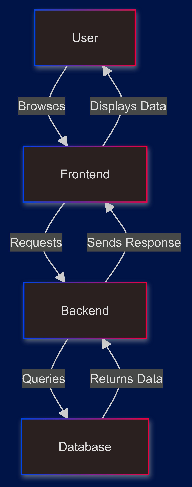
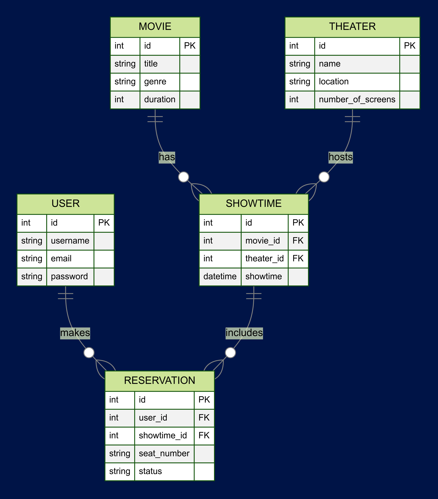

### CineSeat
Movie Ticket Booking System

## System Design

 - **Frontend:** A user interface for customers to browse movies, view showtimes, and make reservations.
 - **Backend:** A REST API that handles business logic, processes user requests, and interacts with the database.
 - **Database:** A relational database to store information about movies, theaters, showtimes, users, and reservations.
 - **Admin Dashboard:** An interface for theater administrators to manage movies, schedules, manage reservations manually and view booking statistics.

### Architecture Diagram

    ```mermaid
    graph TD;
        A[User] -->|Browses| B[Frontend];
        B -->|Requests| C[Backend];
        C -->|Queries| D[Database];
        D -->|Returns Data| C;
        C -->|Sends Response| B;
        B -->|Displays Data| A;
    ```



## Database Schema

    The database is designed to manage the following entities:

    - **Users:** Stores user information such as username, email, and password.
    - **Movies:** Contains details about the movies being shown, including title, genre, and duration.
    - **Theaters:** Holds information about the theaters, including location and number of screens.
    - **Showtimes:** Links movies to theaters at specific times.
    - **Reservations:** Tracks bookings made by users, including seat selection and payment status.

    ### ER Diagram

        ```mermaid
        erDiagram
            USER {
                int id PK
                string username
                string email
                string password
            }
            MOVIE {
                int id PK
                string title
                string genre
                int duration
            }
            THEATER {
                int id PK
                string name
                string location
                int number_of_screens
            }
            SHOWTIME {
                int id PK
                int movie_id FK
                int theater_id FK
                datetime showtime
            }
            RESERVATION {
                int id PK
                int user_id FK
                int showtime_id FK
                string seat_number
                string status
            }
            USER ||--o{ RESERVATION : makes
            MOVIE ||--o{ SHOWTIME : has
            THEATER ||--o{ SHOWTIME : hosts
            SHOWTIME ||--o{ RESERVATION : includes
        ```
    


    ### Database Schema Definition

        ```sql
            CREATE TABLE users (
                id INT PRIMARY KEY,
                username VARCHAR(50),
                email VARCHAR(100),
                password VARCHAR(100)
            );

            CREATE TABLE movies (
                id INT PRIMARY KEY,
                title VARCHAR(100),
                genre VARCHAR(50),
                duration INT
            );

            CREATE TABLE theaters (
                id INT PRIMARY KEY,
                name VARCHAR(100),
                location VARCHAR(100),
                number_of_screens INT
            );

            CREATE TABLE showtimes (
                id INT PRIMARY KEY,
                movie_id INT REFERENCES movies(id),
                theater_id INT REFERENCES theaters(id),
                showtime DATETIME
            );

            CREATE TABLE reservations (
                id INT PRIMARY KEY,
                user_id INT REFERENCES users(id),
                showtime_id INT REFERENCES showtimes(id),
                seat_number VARCHAR(10),
                status VARCHAR(20)
            );
            ```


For more details on system design and implementation, please refer to the [Detailed Documentation](docs/detailed_documentation.md).
