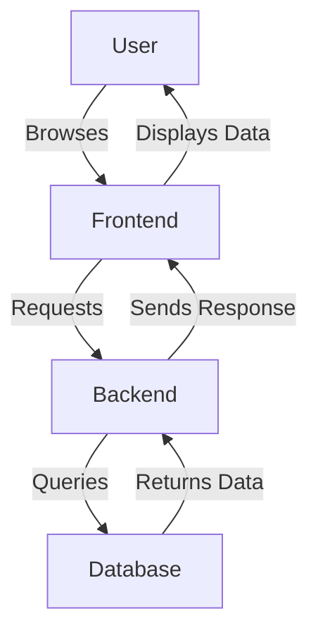

# CineSeat
Movie Ticket Booking System

## System Design

 - **Frontend:** A user interface for customers to browse movies, view showtimes, and make reservations.
 - **Backend:** A REST API that handles business logic, processes user requests, and interacts with the database.
 - **Database:** A relational database to store information about movies, theaters, showtimes, users, and reservations.
 - **Admin Dashboard:** An interface for theater administrators to manage movies, schedules, manage reservations manually and view booking statistics.

### Architecture Diagram




## Database Schema

The database is designed to manage the following entities:

- **Users:** Stores user information such as username, email, and password.
- **Movies:** Contains details about the movies being shown, including title, genre, and duration.
- **Theaters:** Holds information about the theaters, including location and number of screens.
- **Showtimes:** Links movies to theaters at specific times.
- **Reservations:** Tracks bookings made by users, including seat selection and payment status.

### ER Diagram

```mermaid
 erDiagram
USER {
    int id PK
    string username
    string email
    string password
}
MOVIE {
    int id PK
    string title
    string genre
    int duration
}
THEATER {
    int id PK
    string name
    string location
    int number_of_screens
}
SHOWTIME {
    int id PK
    int movie_id FK
    int theater_id FK
    datetime showtime
}
RESERVATION {
    int id PK
    int user_id FK
    int showtime_id FK
    string seat_number
    string status
}
USER ||--o{ RESERVATION : makes
MOVIE ||--o{ SHOWTIME : has
THEATER ||--o{ SHOWTIME : hosts
SHOWTIME ||--o{ RESERVATION : includes           
 ```
        
    


### Database Schema Definition

 ```sql
    CREATE TABLE users (
        id INT PRIMARY KEY,
        username VARCHAR(50),
        email VARCHAR(100),
        password VARCHAR(100)
    );

    CREATE TABLE movies (
        id INT PRIMARY KEY,
        title VARCHAR(100),
        genre VARCHAR(50),
        duration INT
    );

    CREATE TABLE theaters (
        id INT PRIMARY KEY,
        name VARCHAR(100),
        location VARCHAR(100),
        number_of_screens INT
    );

    CREATE TABLE showtimes (
        id INT PRIMARY KEY,
        movie_id INT REFERENCES movies(id),
        theater_id INT REFERENCES theaters(id),
        showtime DATETIME
    );

    CREATE TABLE reservations (
        id INT PRIMARY KEY,
        user_id INT REFERENCES users(id),
        showtime_id INT REFERENCES showtimes(id),
        seat_number VARCHAR(10),
        status VARCHAR(20)
    );
```       

## API Design

The Movie Booking System exposes the following RESTful APIs for interaction between the frontend and backend:

    | Method | Endpoint          | Description                                         |
    |--------|-------------------|-----------------------------------------------------|
    | GET    | /api/movies        | Retrieves a list of all movies                      |
    | GET    | /api/movies/{id}   | Retrieves details of a specific movie by ID         |
    | POST   | /api/reservations  | Creates a new reservation                           |
    | GET    | /api/reservations  | Retrieves all reservations for the logged-in user   |
    | POST   | /api/auth/login    | Authenticates a user and returns a JWT token        |
    | POST   | /api/auth/register | Registers a new user                                |

### Frontend-Backend Interaction

The frontend interacts with the backend via these APIs by sending HTTP requests. For example, when a user selects a movie and makes a reservation, the frontend sends a POST request to the `/api/reservations` endpoint with the reservation details.

## Component Design

The system is divided into the following components:

- **Frontend:** Built with React.js, responsible for rendering the user interface and making API calls to the backend.
- **Backend:** Developed using Node.js with Express, handling business logic, API endpoints, and communication with the database.
- **Authentication:** JWT-based authentication using Passport.js to secure the API endpoints.
- **Payment Gateway:** Integration with a payment gateway (e.g., Stripe) to handle payments securely.

Each component is designed to be modular and scalable, allowing for easy updates and maintenance.

## Scalability and Performance

To ensure the system can handle increased traffic, the following strategies are planned:

- **Load Balancing:** Use of a load balancer to distribute incoming traffic across multiple backend servers.
- **Caching:** Implementation of caching mechanisms (e.g., Redis) to reduce database load and improve response times.
- **Database Optimization:** Indexing and query optimization in the database to handle large volumes of data efficiently.

## Security Design

Security is a critical aspect of the Movie Booking System:

- **User Authentication:** JWT tokens are used for authenticating users, ensuring that only authorized users can access certain endpoints.
- **Authorization:** Role-based access control (RBAC) to restrict access to specific resources based on user roles (e.g., admin, user).
- **Data Security:** All sensitive data, including passwords and payment information, is encrypted. HTTPS is enforced for all communications.
- **Payment Security:** PCI-DSS compliance is ensured for handling payment data securely through the integrated payment gateway.

## Deployment Strategy

The application will be deployed using the following strategy:

- **Hosting:** The backend and frontend will be deployed on a cloud provider (e.g., AWS, Heroku).
- **CI/CD Pipelines:** Continuous Integration and Continuous Deployment (CI/CD) pipelines will be set up using GitHub Actions or Jenkins to automate testing and deployment.
- **Monitoring and Logging:** Monitoring tools (e.g., Prometheus, Grafana) and logging solutions (e.g., ELK Stack) will be used to track system performance and diagnose issues post-deployment.


For more details on system design and implementation, please refer to the [Detailed Documentation](docs/detailed_documentation.md).
